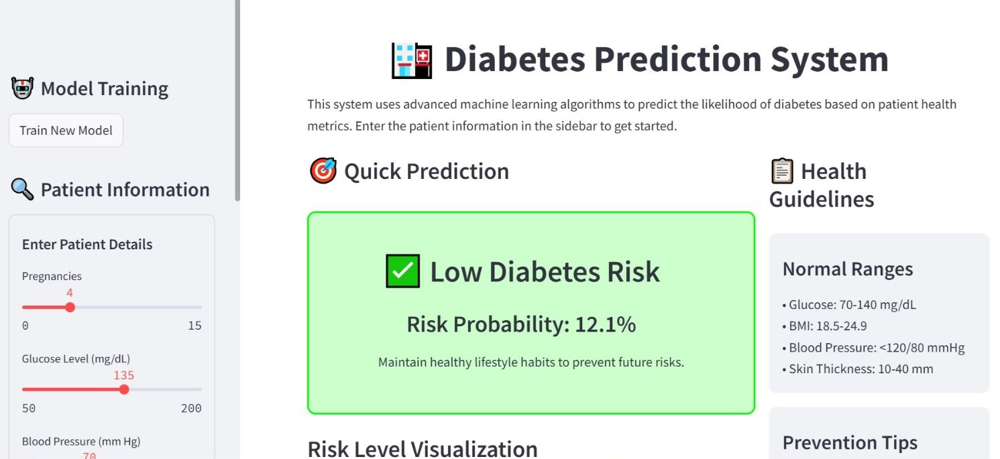

# **GlucoGuard - Diabetes Risk Predictor** 🩸

## **🖥️ App Preview**



*Enter health parameters to get diabetes risk prediction*

## **🚀 Quick Start**

### **1. Clone & Install**
```bash
git clone https://github.com/sanik-b/GlucoGuard.git
cd GlucoGuard
pip install -r requirements.txt
```

### **2. Run the App**
```bash
streamlit run app.py
```

### **3. Open in Browser**
Go to: **http://localhost:8501**

## **🎯 How It Works**
1. **Enter** your health details in the sidebar
2. **Click** "Predict Diabetes Risk"
3. **Get** instant risk percentage (0-100%)
4. **See** personalized recommendations

## **📊 Input Parameters**
| Parameter | Example Value |
|-----------|---------------|
| 👶 Pregnancies | 2 |
| 🩸 Glucose Level | 120 mg/dL |
| 💓 Blood Pressure | 80 mmHg |
| 🦵 Skin Thickness | 25 mm |
| 💉 Insulin | 80 μU/ml |
| 📏 BMI | 25.5 |
| 🧬 Diabetes Pedigree | 0.5 |
| 🔢 Age | 35 years |

## **📈 Sample Results**
- **Low Risk** (0-30%): ✅ Regular checkups advised
- **Medium Risk** (31-70%): ⚠️ Monitor regularly
- **High Risk** (71-100%): ❌ Consult doctor immediately

## **🛠️ Project Files**
```
GlucoGuard/
├── app.py              # Main web application
├── model_training.py   # Machine learning model
├── data_preprocessing.py
├── utils.py
├── diabetes.csv        # Sample dataset
├── requirements.txt    # Python dependencies
└── images/UI.jpeg     # App screenshot
```

## **🤖 Technology Used**
- **Python** - Main programming language
- **Streamlit** - Web interface framework
- **Scikit-learn** - Machine learning library
- **CatBoost** - Gradient boosting algorithm
- **Pandas & NumPy** - Data processing

## **⚠️ Important Notice**
**This tool is for educational and demonstration purposes only.** It should not be used for medical diagnosis or treatment decisions. Always consult qualified healthcare professionals for medical advice.

## **📞 Contact & Support**
- **GitHub**: [github.com/sanik-b/GlucoGuard](https://github.com/sanik-b/GlucoGuard)
- **Issues**: Report problems on GitHub Issues
- **Questions**: Open a discussion on GitHub

## **👨‍💻 Developer**
**Created by**: Sanika Babar  
**Purpose**: Diabetes risk prediction using ML

---

## **💡 One-Line Installation**
```bash
git clone https://github.com/sanik-b/GlucoGuard.git && cd GlucoGuard && pip install -r requirements.txt && streamlit run app.py
```

---

⭐ **If you find this useful, please give it a star on GitHub!**

**Made with ❤️ to help understand diabetes risk through AI**

---
*Last Updated: December 2024 | Version: 1.0.0*
